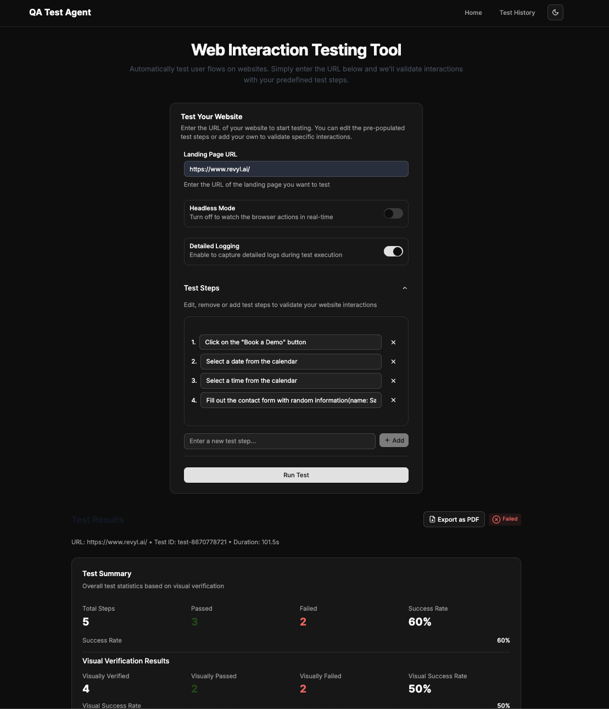
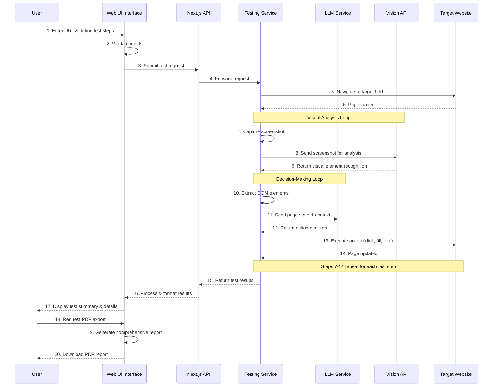

# QA Test Agent

A powerful web interaction testing tool designed to automatically navigate and validate user journeys on any website using AI-powered testing. This tool helps development and QA teams ensure their user flows are working correctly by using intelligent automation to interact with web pages just like a human would.



## Features

- Automatically detect and interact with UI elements on any website
- Simulate complex user interactions and workflows
- Capture screenshots of key steps in the process
- Identify and report any errors or issues
- View test history and results
- Export comprehensive test reports as PDF
- Define custom test steps in natural language
- AI-guided testing with detailed decision reports

## System Architecture



The system works in a continuous feedback loop where:
1. The user defines a URL and custom test steps
2. The Playwright Testing Service navigates to the target website
3. Page state is extracted and analyzed by OpenAI's LLM and Vision API
4. The AI determines the appropriate actions to take based on the test steps
5. Actions are executed and the results are captured
6. The process repeats until all test steps are completed
7. Results are returned to the user with detailed reports and screenshots
8. The user can export a comprehensive PDF report of the test results

## Tech Stack

- **Frontend**: Next.js, React, TypeScript, TailwindCSS, ShadcnUI
- **Backend**: Next.js API Routes
- **Testing**: Playwright for browser automation
- **AI Integration**: OpenAI API for intelligent page navigation
- **Deployment**: Vercel (frontend) and Railway.app (Playwright service) - TBD

## Development Setup

### Prerequisites

- Node.js (v18 or newer)
- npm or yarn
- OpenAI API key (for LLM-guided testing)

### Installation

1. Clone the repository:
```bash
git clone https://github.com/yourusername/booking-agent.git
cd booking-agent
```

2. Install dependencies:
```bash
npm install
# or
yarn install
```

3. Set up environment variables:
   - Copy `.env.example` to `.env`
   - Add your OpenAI API key and other required configurations

```bash
cp .env.example .env
```

4. Run the development server:
```bash
npm run dev
# or
yarn dev
```

5. Open [http://localhost:3000](http://localhost:3000) in your browser to see the application.

## Running Tests

To test user journeys on any website:

1. Navigate to the homepage
2. Enter the URL of the website you want to test
3. Add custom test steps using natural language instructions (e.g., "Click the login button", "Fill in the username field with 'test@example.com'", "Check if the dashboard loads successfully")
4. Click "Run Test" to start the automated testing process
5. View the results, including screenshots and LLM decisions
6. Export the results as PDF if needed

## Example Results

Sample test results are provided in the `/results` folder. These examples showcase the tool's ability to navigate various websites and workflows, demonstrating the format of test reports for different user journeys.

## Architecture Documentation

For detailed information about the system design, components, and implementation details, please refer to the [Architecture Documentation](docs/ARCHITECTURE.md).

The architecture document covers:
- High-level system overview and sequence diagrams
- Frontend and backend components
- LLM integration and feedback loop
- PDF export functionality
- DOM interaction layer
- Deployment architecture

## Project Structure

- `/src` - Source code
  - `/app` - Next.js app router pages
  - `/components` - React components
  - `/lib` - Utility functions and shared code
- `/public` - Static assets
- `/docs` - Project documentation
- `/results` - Example test results

## Contributing

1. Create a feature branch
2. Make your changes
3. Submit a pull request
