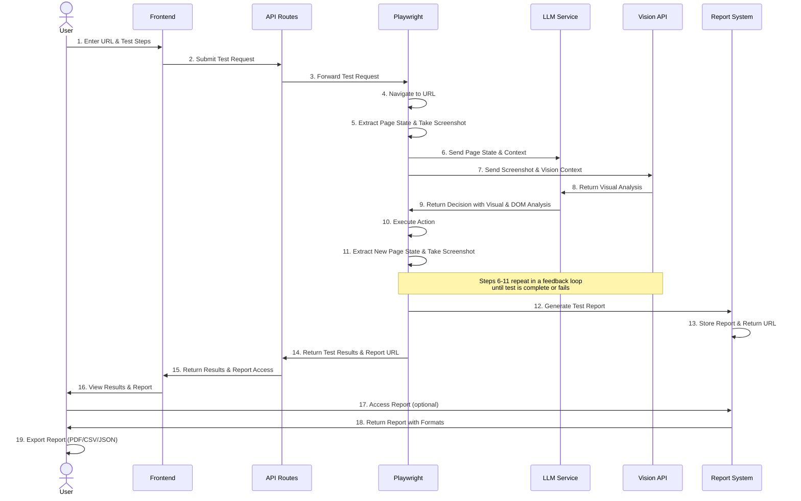

# QA Test Agent - Architecture

## 1. System Overview

The QA Test Agent is a powerful web interaction testing tool that automatically navigates and validates user journeys on any website using AI-powered testing. The system consists of three main components:

1. **Next.js Frontend**: User interface for entering URLs, defining test steps, and viewing test results
2. **Next.js API Routes**: Handles requests and orchestrates testing
3. **Playwright Testing Service**: Executes browser automation with LLM guidance

The system leverages OpenAI's Vision API for advanced visual analysis of web pages, enabling more accurate element identification and interaction decisions.

## 2. Interaction Flow Sequence

The following sequence diagram illustrates the high-level flow of test execution, including the LLM feedback loop with Vision API integration and reporting system:



### Key Stages in the LLM Feedback Loop:

1. **Initial Navigation**: The Playwright service loads the target URL
2. **Page State Extraction**: DOM elements, structure, and visual information are extracted
3. **Visual Analysis**: Screenshots are sent to the Vision API for visual understanding
4. **LLM Consultation**: Page state and visual analysis are sent to the LLM with context and instructions
5. **Decision Making**: LLM analyzes the page using both DOM and visual information to recommend the next action
6. **Action Execution**: Playwright executes the recommended action (click, input, etc.)
7. **Result Capture**: New page state is captured and screenshots are taken
8. **Feedback Loop**: The new state is sent back to the LLM and Vision API with previous context
9. **Continuation**: Steps 3-8 repeat until the test completes or fails
10. **Report Generation**: Comprehensive test report is created and stored in the reporting system
11. **Results Access**: User can view results directly and access detailed reports through the reporting system

This intelligent feedback loop enables the system to adapt to different websites and UI patterns, making decisions based on both visual appearance and DOM structure, similar to how a human would interact with a web page.

## 3. High-Level Architecture

```
┌─────────────────┐         ┌────────────────────┐         ┌─────────────────────┐
│                 │         │                    │         │                     │
│  Next.js        │  HTTP   │  Next.js           │  HTTP   │  Playwright Testing │
│  Frontend       │────────►│  API Routes        │────────►│  Service with LLM   │
│  (Vercel)       │◄────────│  (Vercel)          │◄────────│  (Railway.app)      │
│                 │         │                    │         │                     │
└─────────────────┘         └────────────────────┘         └─────────────────────┘
       ▲                            ▲                              ▲
       │                            │                              │
       │                            │                              │
       │                            │                              │
       ▼                            ▼                              ▼
┌─────────────────┐         ┌────────────────────┐         ┌─────────────────────┐
│  UI Components  │         │ Request Processing │         │ Testing Components  │
│  • URL Input    │         │ • Validation       │         │ • DOM Interaction   │
│  • Test Results │         │ • Error Handling   │         │ • LLM Vision API    │
│  • Screenshots  │         │ • Test Orchestration│        │ • Browser Automation│
│  • PDF Export   │         │                    │         │                     │
│  • Test Reports │         │                    │         │                     │
└─────────────────┘         └────────────────────┘         └─────────────────────┘
```

## 4. Frontend Architecture

```
┌──────────────────────────────────────────────────────────────────┐
│                        Next.js Frontend                          │
│                                                                  │
│  ┌────────────────┐   ┌─────────────────┐   ┌────────────────┐   │
│  │                │   │                 │   │                │   │
│  │  URL Input     │──►│  Test Execution │──►│  Test Results  │   │
│  │  Component     │   │  State          │   │  Display       │   │
│  │                │   │                 │   │                │   │
│  └────────────────┘   └─────────────────┘   └────────────────┘   │
│                              │                      ▲             │
│                              │                      │             │
│                              ▼                      │             │
│  ┌────────────────┐   ┌─────────────────┐   ┌────────────────┐   │
│  │                │   │                 │   │                │   │
│  │  Custom Test   │──►│  API Service    │──►│  Screenshots   │   │
│  │  Steps Input   │   │  (API Calls)    │   │  Component     │   │
│  │                │   │                 │   │                │   │
│  └────────────────┘   └─────────────────┘   └────────────────┘   │
│                                                    │             │
│                                                    │             │
│                                                    ▼             │
│  ┌────────────────┐                                              │
│  │                │                                              │
│  │  PDF Export    │                                              │
│  │  Component     │                                              │
│  │                │                                              │
│  └────────────────┘                                              │
│                                                                  │
└──────────────────────────────────────────────────────────────────┘
```

Key components:
- **URL Input Form**: Collects the landing page URL and optional custom test steps
- **Test Results Display**: Shows status, steps, screenshots, and errors
- **API Service**: Handles communication with backend
- **Screenshots Component**: Displays test progression visually 
- **Custom Test Steps**: Allows defining natural language test instructions
- **PDF Export**: Enables exporting test results as a comprehensive PDF report

## 5. Backend Architecture

```
┌──────────────────────────────────────────────────────────────────┐
│                     Next.js API Routes                           │
│                                                                  │
│  ┌────────────────┐   ┌─────────────────┐   ┌────────────────┐   │
│  │                │   │                 │   │                │   │
│  │  Request       │──►│  Validation &   │──►│  Playwright    │   │
│  │  Handler       │   │  Processing     │   │  Service Proxy │   │
│  │                │   │                 │   │                │   │
│  └────────────────┘   └─────────────────┘   └────────────────┘   │
│                                                    │             │
└────────────────────────────────────────────────────┼─────────────┘
                                                     │
                                                     ▼
┌──────────────────────────────────────────────────────────────────┐
│                    Playwright Testing Service                     │
│                                                                  │
│  ┌────────────────┐   ┌─────────────────┐   ┌────────────────┐   │
│  │                │   │                 │   │                │   │
│  │  Test          │──►│  LLM Service    │──►│  Results       │   │
│  │  Orchestration │   │  Integration    │   │  Processor     │   │
│  │                │   │                 │   │                │   │
│  └────────────────┘   └─────────────────┘   └────────────────┘   │
│           │                    ▲                    ▲             │
│           │                    │                    │             │
│           ▼                    │                    │             │
│  ┌────────────────┐            │                    │             │
│  │                │            │                    │             │
│  │  DOM           │                                 │             │
│  │  Interaction   │─────────────────────────────────┘             │
│  │  Layer         │                                               │
│  └────────────────┘                                               │
│                                                                  │
└──────────────────────────────────────────────────────────────────┘
```

Key components:
- **API Routes**: Handle requests and proxy to testing service
- **Test Orchestration**: Controls the testing process flow
- **DOM Interaction Layer**: Provides generic interface for browser automation
- **LLM Service**: AI guidance for test navigation
- **Results Processor**: Formats and returns test results

## 6. Test Execution Flow

```
┌─────────────────┐     ┌─────────────────┐     ┌─────────────────┐
│                 │     │                 │     │                 │
│  Landing Page   │────►│  Demo Button    │────►│  Demo Button    │
│  Load           │     │  Detection      │     │  Click          │
│                 │     │                 │     │                 │
└─────────────────┘     └─────────────────┘     └────────┬────────┘
                                                         │
                                                         ▼
┌─────────────────┐     ┌─────────────────┐     ┌─────────────────┐
│                 │     │                 │     │                 │
│  Confirmation   │◄────│  Form           │◄────│  Form Detection │
│  Check          │     │  Submission     │     │  & Filling      │
│                 │     │                 │     │                 │
└─────────────────┘     └─────────────────┘     └─────────────────┘
        │
        ▼
┌─────────────────┐
│                 │
│  Results        │
│  Generation     │
│                 │
└─────────────────┘
```

## 7. LLM Integration and DOM Interaction

```
┌──────────────────────┐          ┌───────────────────────┐
│                      │          │                       │
│  DOM Interaction     │◄────────►│  LLM Decision Engine  │
│  Layer               │          │  (OpenAI API)         │
│                      │          │                       │
└──────────┬───────────┘          └───────────────────────┘
           │                                   ▲
           │                                   │
           ▼                                   │
┌──────────────────────┐          ┌───────────────────────┐
│                      │          │                       │
│  Page State          │─────────►│  Prompt Construction  │
│  Extraction          │          │  & Context Building   │
│                      │          │                       │
└──────────────────────┘          └───────────────────────┘
           │                                   ▲
           │                                   │
           ▼                                   │
┌──────────────────────┐          ┌───────────────────────┐
│                      │          │                       │
│  Visual Element      │─────────►│  OpenAI Vision API    │
│  Capture             │          │  Integration          │
│                      │          │                       │
└──────────────────────┘          └───────────────────────┘
```

### OpenAI Vision API Integration

The system now incorporates OpenAI's Vision API to enhance the decision-making process:

1. **Visual Analysis**
   - Captures screenshots of the current page state
   - Sends images to OpenAI Vision API along with contextual instructions
   - Receives element identification with visual reasoning

2. **Visual-DOM Correlation**
   - Combines visual element recognition with DOM structure analysis
   - Maps visual elements to actionable DOM selectors
   - Provides more accurate element targeting, especially for complex layouts

3. **Enhanced Decision Making**
   - Uses visual context to better understand page structure and user interface
   - Makes more human-like decisions about which elements to interact with
   - Improves handling of visually complex pages with ambiguous DOM structures

This vision-enhanced approach significantly improves the system's ability to navigate complex web interfaces and make intelligent decisions about element interaction.

## 8. PDF Export Feature

```
┌────────────────────────────────────────────────────────────────┐
│                       PDF Export System                        │
│                                                                │
│  ┌────────────────┐   ┌─────────────────┐   ┌────────────────┐ │
│  │                │   │                 │   │                │ │
│  │  Test Results  │──►│  HTML to Canvas │──►│  Canvas to PDF │ │
│  │  Component     │   │  Conversion     │   │  Conversion    │ │
│  │                │   │                 │   │                │ │
│  └────────────────┘   └─────────────────┘   └────────────────┘ │
│                                                    │           │
│                                                    │           │
│                                                    ▼           │
│  ┌────────────────┐   ┌─────────────────┐   ┌────────────────┐ │
│  │                │   │                 │   │                │ │
│  │  Accordion     │   │  PDF            │   │  File          │ │
│  │  Management    │◄──┤  Generation     │◄──┤  Download      │ │
│  │                │   │  & Formatting   │   │  Trigger       │ │
│  └────────────────┘   └─────────────────┘   └────────────────┘ │
│                                                                │
└────────────────────────────────────────────────────────────────┘
```

Key components:
- **PDF Generation Utility**: Client-side PDF creation from test results
- **HTML to Canvas Conversion**: Captures DOM elements as images for PDF inclusion
- **Content Formatting**: Organizes test data in a readable PDF format
- **Element Management**: Handles expanding accordions for complete capture
- **Download Trigger**: Initiates browser download of the generated PDF

The PDF export feature leverages client-side JavaScript libraries (jsPDF and html2canvas) to create comprehensive test reports that include:
- Test metadata (URL, duration, test ID)
- Overall test status
- Step-by-step results with screenshots
- LLM decision details for each step
- Error information where applicable

This client-side approach ensures privacy and performance by generating the PDF directly in the user's browser without sending data to external servers.

## 9. API Specifications

### POST /api/test-website

**Request Body**:
```json
{
  "url": "https://example.com",
  "customSteps": [
    "Click on the login button",
    "Fill in the username field with 'test@example.com'",
    "Enter 'password123' in the password field",
    "Click the submit button",
    "Verify the dashboard is displayed"
  ]
}
```

**Response Body**:
```json
{
  "success": true,
  "testId": "test-123",
  "url": "https://example.com",
  "interactionSuccessful": true,
  "steps": [
    {
      "name": "Page Load",
      "status": "success",
      "duration": 1240,
      "screenshot": "base64-encoded-image",
      "llmDecision": {
        "action": "identify_element",
        "confidence": 95,
        "reasoning": "Looking for login button based on instruction...",
        "visualAnalysis": "The page shows a prominent blue button labeled 'Log In' in the top right corner",
        "targetElement": {
          "tag": "button",
          "id": "login-btn",
          "text": "Log In",
          "classes": ["btn", "primary-button"]
        }
      }
    }
  ],
  "customStepsResults": [
    {
      "instruction": "Click on the login button",
      "success": true,
      "screenshot": "base64-encoded-image",
      "llmDecision": {
        "action": "click",
        "confidence": 90,
        "reasoning": "Identified button with text 'Log In'",
        "visualAnalysis": "The button is clearly visible and appears to be clickable",
        "targetElement": {
          "tag": "button",
          "text": "Log In",
          "classes": ["btn", "primary-button"]
        }
      }
    }
  ],
  "totalDuration": 6390,
  "errors": [],
  "report": {
    "url": "https://example.com/reports/test-123",
    "exportedAt": "2023-06-15T10:30:45Z"
  }
}
```

## 10. Deployment Architecture

The system uses a hybrid deployment model:

1. **Next.js Frontend & API Routes**: Deployed on Vercel
   - Global CDN for fast asset delivery
   - Serverless functions for API routes
   - GitHub integration for CI/CD

2. **Playwright Testing Service**: Deployed on Railway.app
   - Containerized environment for browser automation
   - Sufficient resources for Playwright execution
   - Longer execution timeouts than serverless functions

This approach solves:
- Resource limitations of serverless functions
- Execution time constraints
- Browser automation environment requirements

## 11. Security & Monitoring

- **Input Validation**: URL validation to prevent injection attacks
- **Rate Limiting**: Protection against abuse
- **Error Handling**: Graceful degradation and detailed logging
- **Monitoring**: Performance metrics and error tracking

## 12. DOM Interaction Layer Details

### Structure

```
┌─────────────────────────────────────────────────────────────┐
│                     BaseDOMInteractor                       │
│                                                             │
│  • Abstract interface for all DOM operations                │
│  • Defines standard methods for element interaction         │
│  • Provides consistent return types and error patterns      │
│                                                             │
└───────────────────────────┬─────────────────────────────────┘
                            │
                            │ implements
                            ▼
┌─────────────────────────────────────────────────────────────┐
│                  PlaywrightDOMInteractor                    │
│                                                             │
│  • Concrete implementation using Playwright                 │
│  • Handles selector building and element finding            │
│  • Implements error handling and logging                    │
│  • Extracts page state and element information              │
│                                                             │
└───────────────────────────┬─────────────────────────────────┘
                            │
                            │ uses
                            ▼
┌─────────────────────────────────────────────────────────────┐
│                     BookingFlowTest                         │
│                                                             │
│  • Orchestrates testing process                             │
│  • Uses DOM Interactor for all browser interactions         │
│  • Integrates with LLM for decision making                  │
│  • Processes and returns test results                       │
│                                                             │
└─────────────────────────────────────────────────────────────┘
```

### Key Features

- **Flexible Element Representation**: The `InteractableElement` interface provides multiple ways to identify elements (id, classes, text, attributes, etc.)
- **Smart Selector Building**: Converts high-level element descriptions into effective selectors
- **Comprehensive API**: Covers all common DOM operations needed for testing
- **Error Resilience**: Each method returns a success indicator and handles errors appropriately
- **Screenshot Integration**: Built-in methods for capturing visual state

## 13. Test Reports Generation

```
┌──────────────────────────────────────────────────────────────────┐
│                       Test Reports System                        │
│                                                                  │
│  ┌────────────────┐   ┌─────────────────┐   ┌────────────────┐   │
│  │                │   │                 │   │                │   │
│  │  Test Results  │──►│  Report         │──►│  Storage &     │   │
│  │  Collection    │   │  Generation     │   │  Retrieval     │   │
│  │                │   │                 │   │                │   │
│  └────────────────┘   └─────────────────┘   └────────────────┘   │
│           │                    │                    ▲             │
│           │                    │                    │             │
│           ▼                    ▼                    │             │
│  ┌────────────────┐   ┌─────────────────┐   ┌────────────────┐   │
│  │                │   │                 │   │                │   │
│  │  Visual Data   │   │  Structured     │──►│  Report        │   │
│  │  Processing    │──►│  Data Formatting│   │  API Endpoint  │   │
│  │                │   │                 │   │                │   │
│  └────────────────┘   └─────────────────┘   └────────────────┘   │
│                                                    │             │
│                                                    │             │
│                                                    ▼             │
│  ┌────────────────┐   ┌─────────────────┐   ┌────────────────┐   │
│  │                │   │                 │   │                │   │
│  │  Report        │◄──┤  Access Control │◄──┤  Report        │   │
│  │  Viewer UI     │   │  & Sharing      │   │  Download      │   │
│  │                │   │                 │   │                │   │
│  └────────────────┘   └─────────────────┘   └────────────────┘   │
│                                                                  │
└──────────────────────────────────────────────────────────────────┘
```

Key components:
- **Test Results Collection**: Gathers all test data, including steps, screenshots, and LLM decisions
- **Visual Data Processing**: Optimizes screenshots and visual elements for report inclusion
- **Report Generation**: Creates structured, readable reports from test data
- **Structured Data Formatting**: Converts raw test data into formatted, presentable information
- **Storage & Retrieval**: Manages storage and access to generated reports
- **Report API Endpoint**: Provides programmatic access to test reports
- **Report Viewer UI**: Renders reports in a user-friendly format
- **Access Control & Sharing**: Manages permissions and sharing capabilities
- **Report Download**: Enables downloading reports in various formats

The test reports system provides comprehensive documentation of test runs, including:
- Test metadata (URL, timestamp, test ID)
- Step-by-step results with visual and textual information
- LLM decision details with visual analysis reasoning
- Success/failure indicators with detailed error information
- Visual evidence through optimized screenshots
- Performance metrics and timing data

Reports are accessible through a dedicated UI and can be downloaded for offline use or sharing with stakeholders.

## 14. Conclusion

This architecture provides a scalable, reliable system for automated web interaction testing using AI-powered decision making. The QA Test Agent's separation of concerns between the Next.js frontend/API, the DOM Interaction Layer, and the LLM decision engine enables efficient resource utilization and a high degree of flexibility and maintainability. 

The intelligent feedback loop between the browser automation and LLM components allows the system to adapt to virtually any website interface without predefined test scripts. This makes it possible to test complex user journeys using natural language instructions that non-technical stakeholders can easily define.

The addition of the OpenAI Vision API integration significantly enhances the system's ability to understand and interact with web pages in a more human-like manner, particularly for visually complex interfaces. The comprehensive test reporting system further strengthens the utility of the tool by providing detailed, accessible documentation of test results for better communication and analysis.

The PDF export feature enhances the utility of the system by providing comprehensive, shareable test reports that detail the testing process and results, making it easier for teams to document and communicate test outcomes.
